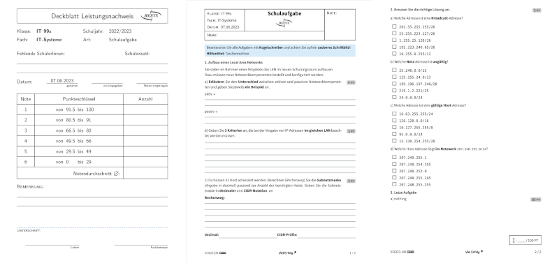
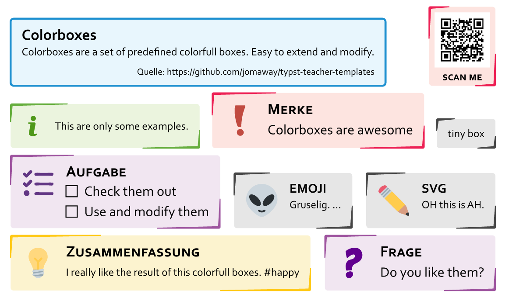

# Typst Templates

A collection of some `typst` templates.

Mainly used to create worksheets and exams for my classes. 

## Usage

At the moment there are 3 templates

+ one for creating worksheets for my lessons
+ another for creating exams.
+ and a slide template for presentations

### Create an Exam

Requires `typst 0.5`



Creating an exam like in the screenshot is as easy like that:

```
#show: exam.with(
    kind: "Schulaufgabe",  // specifiy the kind of exam
    date: datetime(year:2023, month: 5, day: 1),   // new datetime support
    class: "12b",
    subject: "IT-Systeme", 
    authors: ("JM"),
    aids: "TR", // Permitted aids -> default: none else takes a string.
    lsg: false, // if true it will show the content of #solution[] in a red color. 
    print_cover: true,  // print cover page
)

#task[Task number one]
Desribtion for task one. A counter is used to update the numbering.
#question(points: 2)[This will be question a) for task 1]
#solution[If you want you can describe some solution here.]
#question(points: 2)[This will be question b) for task 1]

// NEW ! - You can now use headings for tasks or questions

= This is a task title
== This is a question without points.

// NEW multiple choice questions.

#mct(choices("x","y","z"), answer: 1) 

```
`#task` describes an overall task and is numbered while `#question` means a specific question for that task and is prefixed with an letter. 

See example folder for further examples and usecases.

## Components

In the components folder are some components packages which might be usefull.

### Colorboxes

Colorboxes are a set of predefined colorfull boxes. Easy to extend and modify.



## VS Code integration

Activate [typst-lsp](https://open-vsx.org/extension/nvarner/typst-lsp) extention for better syntax highlightning.

And add the following to `settings.json` if you don't want to compile the templates on saving the file.

```json
{
    "typst-lsp.exportPdf": "never",
}
```

# Credits

Credits to some people which templates i used or extended for my usecase.

- [lostpy](https://gitlab.com/LostPy/lostpy-typst-templates) for code-box
- [lvignoli](https://github.com/lvignoli/diapo) for slides
